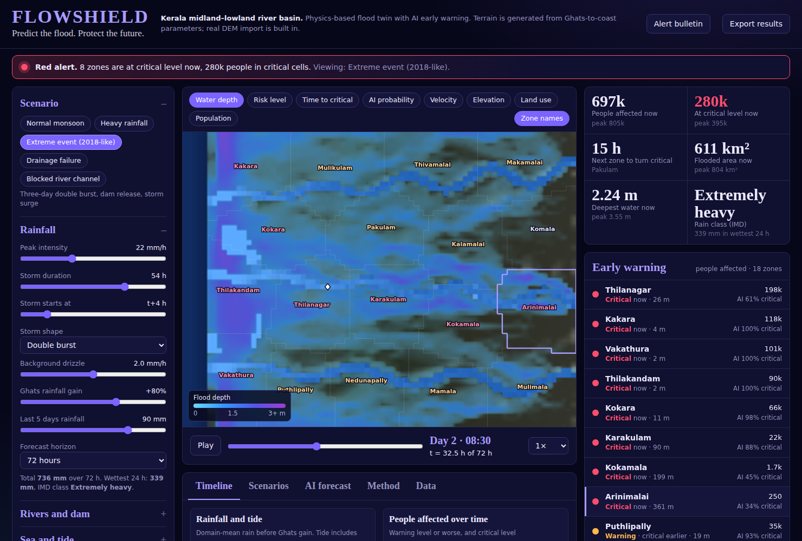
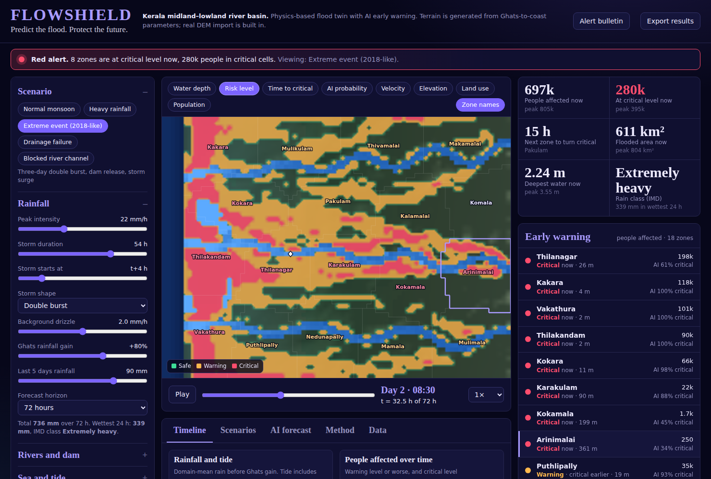
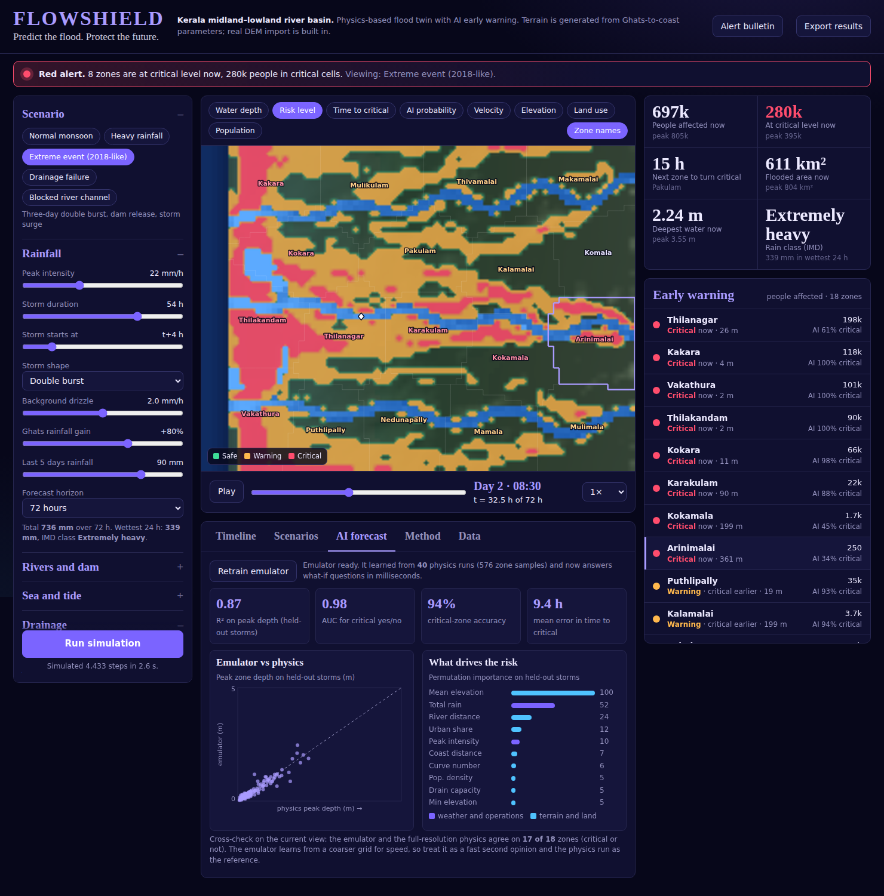
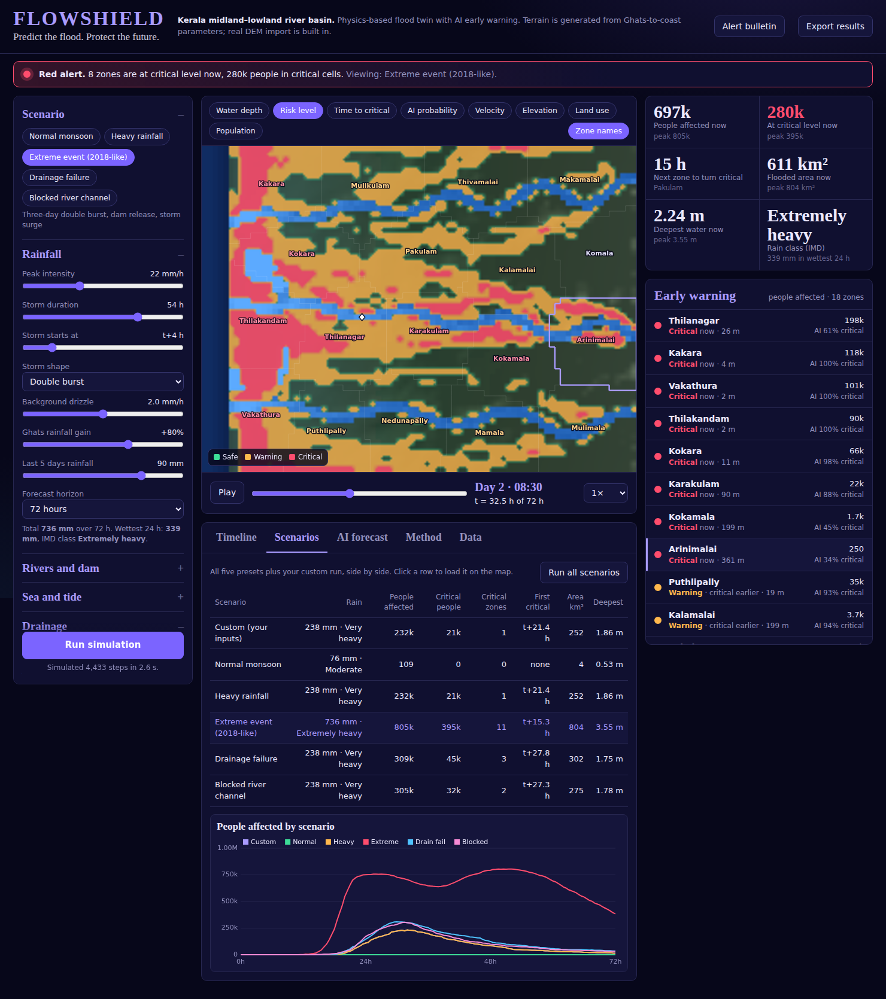

# FlowShield

**Predict the flood. Protect the future.**

A physics-based flood simulation and early-warning dashboard for Kerala. It models how rain, rivers, drains, dams and the sea combine to flood a river basin. It then turns the water depths into zone-level warnings with a countdown to critical conditions, an estimate of people affected, evacuation advice and a bilingual alert bulletin. A neural-network emulator, trained on the physics itself, adds instant what-if answers and probabilities.

- **Zero dependencies.** One self-contained HTML file. No server, no build tools, no packages.
- **Nothing is hard-coded.** Terrain, rivers, land use, population, zones and every flood result are computed. Change a seed, a slider or a rainfall file and the whole basin responds. Real elevation data can be imported.
- **Numbers you can defend.** Water movement uses the local-inertial shallow-water scheme behind operational flood models, and every run reports its own water-balance error (0.000% in the shipped scenarios).



---

## Contents

1. [Quick start](#1-quick-start)
2. [What the dashboard does](#2-what-the-dashboard-does)
3. [How this differs from a typical flood demo](#3-how-this-differs-from-a-typical-flood-demo)
4. [The mathematics](#4-the-mathematics)
   - [4.1 The virtual basin](#41-the-virtual-basin)
   - [4.2 Rainfall and runoff (SCS Curve Number)](#42-rainfall-and-runoff-scs-curve-number)
   - [4.3 Water movement (local-inertial shallow-water equations)](#43-water-movement-local-inertial-shallow-water-equations)
   - [4.4 Drainage, blockages and tidal lock](#44-drainage-blockages-and-tidal-lock)
   - [4.5 Boundaries: upstream rivers, dams and the sea](#45-boundaries-upstream-rivers-dams-and-the-sea)
   - [4.6 Numerical safeguards](#46-numerical-safeguards)
   - [4.7 Conservation of water (the self-check)](#47-conservation-of-water-the-self-check)
   - [4.8 From depth to warning: hazard rating and time to critical](#48-from-depth-to-warning-hazard-rating-and-time-to-critical)
   - [4.9 The AI emulator](#49-the-ai-emulator)
5. [Scenarios and results](#5-scenarios-and-results)
6. [Using the dashboard](#6-using-the-dashboard)
7. [Importing real data](#7-importing-real-data)
8. [Project structure](#8-project-structure)
9. [Testing](#9-testing)
10. [Assumptions, limits and the road to real deployment](#10-assumptions-limits-and-the-road-to-real-deployment)
11. [References](#11-references)

---

## 1. Quick start

**Just use it:** open `dist/flowshield.html` in any modern browser (Chrome, Edge, Firefox, Safari). It also works when hosted on GitHub Pages: enable Pages for the repository and serve the `dist/` folder.

On load the app runs the default heavy-rain scenario (about 2 s), then quietly runs the other four presets and trains the AI emulator in the background (about 90 s in total). The AI tab and the "AI %" figures appear when that finishes. Web fonts load from Google Fonts; if you are offline the page falls back to system fonts and works the same.

**Rebuild from source** (only needed if you edit `src/`):

```bash
python3 build.py          # writes dist/flowshield.html
npm test                  # 25 physics/terrain/DEM checks, about 10 s
npm run test:ai           # trains the emulator and checks its accuracy, about 1 min
npm run test:browser      # headless Chromium end-to-end test (pip install playwright first)
```

Requirements for development: Python 3 for the bundler, Node 16 or newer for the tests. The app itself needs neither.

---

## 2. What the dashboard does

The problem statement asks for a system that simulates flooding over time and warns about vulnerable regions. Here is each requirement and where it lives.

| Requirement | How FlowShield meets it |
|---|---|
| Configure rainfall intensity | Peak intensity, duration, start time, storm shape (single, front-loaded, back-loaded, double burst, steady), background drizzle, Ghats rainfall gain, and the last five days' rain. Or load an hourly rainfall CSV. |
| City as a connected grid of regions | An 80 × 60 grid of 550 m cells (44 × 33 km) grouped into 18 named early-warning zones. |
| Water accumulation and movement between regions | Full 2-D shallow-water flow between all neighbouring cells (section 4.3). |
| Drainage capacity, terrain and elevation | Per-cell drain capacity by land use, a global capacity slider, and a terrain with Ghats, midland, backwater lowland, beach ridge and meandering rivers. |
| Water levels over time | 30-minute frames over a 48, 72 or 96 hour horizon. |
| Safe / Warning / Critical | Depth and hazard-rating thresholds per cell, and a share-of-area trigger per zone (section 4.8). |
| Time-based visualisation | Play button and time slider over eight map layers, plus four time-series charts. |
| Regions that reach critical levels | Zone table sorted by urgency, the risk map layer and an alert banner. |
| Estimated time to critical | Countdown per zone and per cell, measured from the time on the slider. |

**Bonus features**

| Bonus | Implementation |
|---|---|
| Normal rainfall | "Normal monsoon" preset. |
| Heavy rainfall | "Heavy rainfall" preset (190 mm in the wettest 24 h, IMD "Very heavy"). |
| Drainage failure | "Drainage failure" preset, and a paint tool to clog drains anywhere. |
| Blocked drainage channel | "Blocked river channel" preset, and a click tool to drop a debris jam on any river. |
| Compare scenarios | Scenarios tab: table and overlay chart for all presets and your custom run. |
| Estimated affected population | Computed from per-cell population; shown as people affected, people at critical level, and per zone. |
| Interactive time slider | Timebar under the map; playback at 1×, 2×, 4×. |

**Extras beyond the brief**

- Dam releases, tides and storm surge as boundary conditions.
- AI emulator with probability of critical per zone, time-to-critical estimates and explainability.
- Evacuation advice: nearest zone that stays dry, with distance and direction.
- Alert bulletin in English and Malayalam plus a Common Alerting Protocol (CAP) JSON message.
- Real DEM import (Esri ASCII or CSV), rainfall CSV import, results export.
- A running water-balance check on every simulation.



---

## 3. How this differs from a typical flood demo

A common approach to this problem is: make a grid, give each cell an elevation and a drainage number, add rain each step, and move water to the lowest neighbour with a hand-tuned rule. It produces a picture, but the numbers are not derived from anything, and a reviewer cannot ask why a value is what it is.

FlowShield is built as a **digital twin of a basin** instead. Four decisions follow from that.

1. **Physics decides outcomes.** Water moves by a real approximation of the shallow-water equations (Bates et al. 2010, the scheme in LISFLOOD-FP). Roughness, runoff and drainage are physical quantities with units, not tuning knobs.
2. **The output is a warning, not a picture.** Real early-warning agencies need zone-level classes, people at risk and lead time. Every panel is built around: which zone, how bad, in how many hours, how many people, where to go.
3. **Scenarios are inputs, not code.** Rain, dam release, tide, drain failure and river blockage all feed one solver. The five presets are five input sets. Even where the blockage goes is computed from the terrain (about 2.5 km upstream of the main-river gauge), not hard-coded. This is why every bonus scenario cost almost no extra code.
4. **AI supports the physics, it does not replace it.** The neural network learns from physics runs and is scored against physics it has never seen. It provides speed and probability. The physics remains the referee.

A side benefit of working in physical units is the built-in water-balance check (section 4.7): a wrong solver leaks or creates water, and this one visibly does not.

---

## 4. The mathematics

Notation: $\Delta x$ is the cell size (550 m), $\Delta t$ the time step, $z$ bed elevation (m), $h$ water depth (m), $\eta = z + h$ water-surface elevation, $q$ flow per unit width ($\mathrm{m^2\,s^{-1}}$), $g = 9.81\ \mathrm{m\,s^{-2}}$, $n$ Manning roughness ($\mathrm{s\,m^{-1/3}}$).

### 4.1 The virtual basin

Everything is generated from a seed and a few parameters (`src/engine.js`, `makeTerrain`). $x$ is distance from the west edge, $x_c = 3$ km is the coast, $x_l = \max(0, x - x_c)$ the distance inland and $L = W - x_c$ the inland length.

**Elevation profile.** The smooth Ghats-to-coast profile is

$$z_{\text{base}}(x_l) = Z_{\text{relief}}\left(\frac{x_l}{L}\right)^{2.3} + 0.35 \quad\text{(m)}$$

The exponent 2.3 gives a gentle coastal plain that steepens into hills, like Kerala's lowland-midland-highland sequence. Fractal noise (four octaves) is added with amplitude $A = 1.2 + 0.11\,z_{\text{base}}$, so hills are rougher than plains. A beach ridge 1.4 to 2.6 m high sits about 550 m inland, and a backwater band (Kuttanad-like) is blended in at about +0.25 to +0.55 m, with lagoons at $-2$ m that fill to sea level. Sea depth is $-2.5\,((x_c - x)/x_c)^{0.7}$ m.

**Rivers.** Each river is a meandering polyline, $y(x) = y_0 + a\sin\!\left(2\pi x_l/\lambda + \varphi\right)\left(0.25 + 0.75\,x_l/L\right) + s\,x_l$, whose bed falls monotonically to the sea. With $d$ the distance from a cell to the nearest river point and $x_r$ that point's inland distance, the river size factor $\sigma$ (1 for the main river, 0.7 for the others) gives:

$$c_d = \sigma\left(1.5 + 2.6\,(x_r/L)^{0.7}\right),\qquad W_v = \sigma\left(0.8 + 2.4\,(1 - x_r/L)\right)$$

where $c_d$ is the bank-full depth (1.5 to 4.1 m) and $W_v$ the floodplain half-width (km). With channel half-width $w_c = 0.9\,\Delta x$ and floodplain level $z_{fp} = z_{\text{base}}(x_r)$:

$$z = \begin{cases} z_{fp} - c_d + c_d\,(d/w_c)^4 & d < w_c \ \text{(channel, flat-bottomed)}\\[2pt] z_{fp}(1-s) + z_{\text{terrain}}\,s,\ \ s = \text{smoothstep}\!\left(\dfrac{d - w_c}{W_v}\right) & d < w_c + W_v \ \text{(valley floor)}\end{cases}$$

The channel width scales with cell size so rivers stay connected on both the fine and coarse grids.

**Land use, roughness, curve number, drainage and people.** Cells become sea, river, urban, homestead, paddy, plantation or forest using elevation bands, distance to rivers and a city field $U = \sum_k e^{-\lVert \mathbf{r} - \mathbf{r}_k\rVert^2/r_k^2}$ around scored city sites. Each class carries constants:

| Class | Manning $n$ | Curve number | Drain capacity (mm/h) | People per km² |
|---|---|---|---|---|
| River / backwater | 0.035 | 100 | 0 | 0 |
| Urban | 0.050 | 92 | 25 | 5,200 |
| Homestead | 0.070 | 80 | 6 | 1,100 |
| Paddy / wetland | 0.080 | 88 | 8 | 320 |
| Plantation | 0.090 | 72 | 1.5 | 220 |
| Forest | 0.120 | 60 | 0 | 12 |

Population per cell is density $\times$ cell area $\times$ noise in $[0.7, 1.3]$; the total is about 880,000.

**Zones.** 18 early-warning zones come from farthest-point seeding followed by 7 Lloyd (k-means) iterations, giving compact, roughly equal-area regions. Zone names are generated from zone features (river-side zones get "-puzha" or "-kadavu", coastal "-kara", high ground "-mala"). They are synthetic labels.

### 4.2 Rainfall and runoff (SCS Curve Number)

**Rain.** Domain rainfall is a function of time: $P(t) = P_{\text{base}} + P_{\text{peak}}\,f(\tau)$ with $\tau = (t - t_0)/D$ inside the storm window. Shapes are normalised to a peak of 1:

$$f_{\text{bell}} = e^{-\frac{1}{2}\left(\frac{\tau - 0.5}{0.2}\right)^2},\quad f_{\text{front}} = \frac{\tau}{a}e^{1 - \tau/a}\ (a = 0.25),\quad f_{\text{double}} = \min\!\left(1,\ e^{-\frac12\left(\frac{\tau-0.25}{0.1}\right)^2} + e^{-\frac12\left(\frac{\tau-0.75}{0.1}\right)^2}\right)$$

Back-loaded mirrors front-loaded; steady is 1. Rain on each cell is scaled by the **orographic gain** $1 + k\,z/Z_{\text{relief}}$ (default $k = 0.7$) because the Ghats slopes catch far more rain than the coast.

**Runoff.** Rain does not all become flood water; soil and vegetation absorb some. The standard Indian-practice method (SCS Curve Number) with cumulative rain $P$ (mm):

$$S = \frac{25400}{CN} - 254,\qquad I_a = 0.2\,S,\qquad Q = \begin{cases}\dfrac{(P - I_a)^2}{P - I_a + S} & P > I_a\\[4pt] 0 & \text{otherwise}\end{cases}$$

The model tracks cumulative rain per cell, computes cumulative runoff $Q$, and adds the increment $Q_{t} - Q_{t-\Delta t}$ to the water depth each step as *effective rain*. Rivers ($CN = 100$) pass all rain through.

**Antecedent wetness.** A saturated catchment sheds more. With $P_5$ the last five days' rain (mm) and $w = \text{clamp}(P_5/80,\ 0,\ 1)$, CN is interpolated between the dry (AMC I), normal (II) and wet (III) values from the standard conversions:

$$CN_{I} = \frac{4.2\,CN_{II}}{10 - 0.058\,CN_{II}},\qquad CN_{III} = \frac{23\,CN_{II}}{10 + 0.13\,CN_{II}}$$

$w = 0$ gives $CN_I$, $w = 0.5$ gives $CN_{II}$, $w = 1$ gives $CN_{III}$, with linear blending between.

### 4.3 Water movement (local-inertial shallow-water equations)

The full shallow-water equations are expensive. The local-inertial approximation (Bates, Horritt and Fewtrell, 2010) drops the convective acceleration term but keeps the local acceleration, pressure gradient and friction. It is the scheme used by the LISFLOOD-FP flood model and is accurate for the slow, shallow flow of floodplains. Between two neighbouring cells $i$ and $j$:

$$h_f = \max(\eta_i, \eta_j) - \max(z_i, z_j)$$

$$q^{t+\Delta t} = \frac{q_\theta - g\,h_f\,\Delta t\,\dfrac{\eta_j - \eta_i}{\Delta x}}{1 + \dfrac{g\,\Delta t\,n^2\,|q_\theta|}{h_f^{7/3}}},\qquad q_\theta = \theta\,q^t + \tfrac{1-\theta}{2}\left(q^t_{\text{left}} + q^t_{\text{right}}\right),\ \ \theta = 0.85$$

Reading it in words: the numerator is momentum plus the push from the water-surface slope, so water accelerates downhill. The denominator is Manning friction applied implicitly, which keeps shallow flow stable. $h_f$ is the depth of water actually free to cross the interface, so a wall of higher ground blocks flow until the water surface rises above it. The $\theta$ blend damps checkerboard oscillations. Interface roughness is the mean of the two cells' $n$.

Continuity updates the depth of every cell from the fluxes across its four faces plus sources and sinks:

$$\Delta h = \frac{\Delta t}{\Delta x}\sum\left(q_{\text{in}} - q_{\text{out}}\right) + r_{\text{eff}} + \frac{Q_{\text{in}}\Delta t}{\Delta x^2} - d_{\text{drain}}$$

Velocity for the hazard calculation comes from the face fluxes: $u = \dfrac{q_{x,\text{left}} + q_{x,\text{right}}}{2h}$, likewise $v$ in the other axis, and speed is capped at 6 m/s.

### 4.4 Drainage, blockages and tidal lock

Water removed by drains each step in a cell:

$$d_{\text{drain}} = \min\!\Big(h,\ \ c_{\text{cap}}\cdot m\cdot(1 - f)\cdot \epsilon_{\text{tide}}\cdot \Delta t\Big),\qquad \epsilon_{\text{tide}} = 1 - 0.6\,\text{clamp}\!\left(\frac{\eta_{\text{sea}}}{0.9},0,1\right)\text{clamp}\!\left(\frac{8 - z}{6},0,1\right)$$

- $c_{\text{cap}}$ is the land-use drain capacity (table above), converted from mm/h to m/s.
- $m$ is the global capacity slider (0 to 200%).
- $f$ is the failure fraction: 0.9 on cells you paint as clogged (0.92 in the preset).
- $\epsilon_{\text{tide}}$ models **tidal lock**: when the sea is high, low-lying outfalls drain up to 60% worse. This is a real coastal Kerala problem.

Drainage is what makes the *rate* of rain matter: 12 mm/h on a 25 mm/h urban drain does nothing, but the same rain with clogged drains floods the city.

**Blockage.** A blockage raises the bed elevation of a strip of cells across the main river by 8 m, like a landslide dam or a collapsed bridge with debris. Water then backs up, overtops the banks and floods upstream. The click tool places one anywhere on any river.

### 4.5 Boundaries: upstream rivers, dams and the sea

**Upstream catchment.** The map covers only the lower basin, so each river receives flow from the catchment beyond the east edge through a linear reservoir (a standard one-parameter rainfall-runoff model):

$$\frac{dS}{dt} = A\,R_c\,P\,(1 + 0.9k) - \frac{S}{K},\qquad Q_{\text{up}} = Q_{\text{base}} + \frac{S}{K}$$

$$R_c = \min\!\left(0.85,\ 0.15 + 0.45\,w + 0.35\left(1 - e^{-P_{\text{cum}}/250}\right)\right),\qquad Q_{\text{base}} = 0.028\,A\,(0.5 + 0.8\,w)$$

$A$ is the catchment area (default 1,800 km² for the main river, about 29% of that for the others), $K = 12$ h the response time, and $R_c$ the runoff coefficient that rises as rain accumulates, so the catchment "wets up". $Q_{\text{base}}$ is in $\mathrm{m^3/s}$ with $A$ in km². The flow is injected equally into the river cells at the east edge.

**Dam release.** A trapezoid is added to the main river: linear ramp up over 3 h, hold for a chosen time, linear ramp down over 3 h, with a chosen peak in $\mathrm{m^3/s}$. This reproduces the 2018-style situation where reservoir operations, not only rain, drive flooding.

**Sea.** Sea cells are forced each step to a semi-diurnal tide plus a Gaussian storm surge:

$$\eta_{\text{sea}}(t) = -a\cos\!\left(\frac{2\pi t}{12.42\ \text{h}}\right) + S\,\exp\!\left[-\left(\frac{t - t_s}{6\ \text{h}}\right)^2\right]$$

12.42 h is the M2 lunar tide period, $a$ the tidal amplitude and $S$ the surge height peaking at $t_s$. Because the river mouths connect to a forced sea, a high tide or surge produces backwater that raises river levels upstream and floods the coastal lowlands, exactly the compound flooding seen in Kuttanad.

**Initial state.** Rivers start with a chosen depth, lagoons fill to sea level, and paddies start with a chosen standing depth. An 8-hour spin-up (baseflow and tide, no rain, no drainage) then lets rivers settle. Flood depth is always measured relative to the state at the end of spin-up, so normally wet paddies and rivers are not counted as flooding.

### 4.6 Numerical safeguards

| Safeguard | Formula or rule | Why |
|---|---|---|
| Adaptive CFL time step | $\Delta t = \min\!\big(120\ \text{s},\ 0.7\,\Delta x/\sqrt{g\,h_{\max}}\big)$ | Stability; about 4,400 steps for 72 h |
| Froude limiter | $\lvert q\rvert \le h_f\sqrt{g\,h_f}$ | Prevents unphysical supercritical flow from numerical noise |
| Donor-cell mass limiter | If outflow $\times\,\Delta t/\Delta x$ exceeds $h + r_{\text{eff}}$, scale all that cell's outflows down | Never creates negative water, never loses mass |
| Dry threshold | $h_f > 1$ mm | Avoids dividing by tiny depths in $h_f^{7/3}$ |
| Frame alignment | $\Delta t$ is clipped to land exactly on 30-minute frames | Clean time-series and ETAs |

### 4.7 Conservation of water (the self-check)

Every volume is tracked. Over a run, the change in water stored on land must equal what came in minus what left:

$$\Delta V_{\text{storage}} = V_{\text{eff.rain}} + V_{\text{river inflow}} - V_{\text{drained}} - V_{\text{to sea}}$$

The flow into the sea is measured from the depth change in sea cells *before* they are reset to the tide, so the accounting is exact. The dashboard reports the closing error, and the regression tests fail if it exceeds 0.1%. In the shipped scenarios it is 0.000%.

### 4.8 From depth to warning: hazard rating and time to critical

For each land cell and each 30-minute frame, with $d$ the depth above the pre-storm level and $v$ the speed:

$$HR = d\,(v + 0.5)$$

This is the hazard-to-people rating from the UK Environment Agency and Defra flood-risk guidance (FD2320) with the debris factor set to zero. A cell is classified:

$$\text{Critical if } d \ge d_{\text{crit}}\ \text{or}\ HR \ge 1.25,\qquad \text{Warning if } d \ge d_{\text{warn}}\ \text{or}\ HR \ge 0.75$$

Defaults are $d_{\text{warn}} = 0.25$ m and $d_{\text{crit}} = 0.75$ m; both are sliders and reclassification is instant (no re-simulation). A depth of 0.15 m flagged a quarter of the basin in the heavy scenario, which is too trigger-happy for a real warning system, hence the higher default.

**Time to critical.** For each cell a severity index is computed per frame,

$$S_c = \max\!\left(\frac{d}{d_{\text{crit}}},\ \frac{HR}{1.25}\right)$$

and the moment it crosses 1 between frames $k-1$ and $k$ is found by linear interpolation:

$$t_{\text{crit}} = t_{k-1} + \frac{1 - S_{c,k-1}}{S_{c,k} - S_{c,k-1}}\,(t_k - t_{k-1})$$

so ETAs are finer than the frame spacing. The "time to critical" shown is $t_{\text{crit}}$ minus the time on the slider, so the countdown ticks as you scrub.

**Zone level.** A zone is Warning or Critical when at least 10% of its land area (adjustable) reaches that class. This stops one wet cell from raising a whole zone's alarm. The zone's ETA is the interpolated time when that share crosses the trigger.

**People.** Affected people are the summed cell populations of Warning-or-worse cells; critical people count Critical cells only.

**Evacuation advice.** For a flooded lowland zone, the app finds the nearest zone that stays Safe in the same scenario and is at least 6 m higher, then reports distance and compass direction.

### 4.9 The AI emulator

**Purpose.** A full physics run takes about 2 s. That is fine for one scenario but too slow for dragging sliders or testing hundreds of "what if the forecast is wrong" variants. The emulator learns the physics's zone-level answers so it can respond in milliseconds.

**Training data.** 40 random storms are drawn by Latin-hypercube sampling over 13 parameters: peak intensity (2 to 50 mm/h on a log scale), duration, shape, background drizzle, dam release (sometimes zero), storm surge, antecedent rain, drain capacity (20 to 130%), Ghats gain, tide amplitude and event timings. Each storm runs through the physics on a coarser grid (56 × 42, about 1 s each). Each (storm, zone) pair becomes one row: 576 for training and 144 held out. The split is by whole storm, so the test set contains storms the model has never seen in any form.

**Inputs (17).** Nine storm features: log total rain, peak intensity, duration, dam release, surge, antecedent wetness, drain capacity, Ghats gain, wettest-24 h rain. Eight zone features: mean and minimum elevation, curve number, drain capacity, distance to river, urban share, distance to coast, population density. All standardised. Because zone features are inputs, one network serves every zone.

**Network.** A multilayer perceptron with layers $17 \to 24 \to 24 \to 3$, $\tanh$ hidden units, trained with Adam (learning rate 0.006, decaying; batch 32; 220 epochs; small L2). Three outputs and their losses:

$$\mathcal{L} = \underbrace{-\left[y\log\sigma(o_1) + (1-y)\log(1 - \sigma(o_1))\right]}_{\text{reaches critical? (cross-entropy)}} + \underbrace{\left(o_2 - \log(0.02 + d_{90})\right)^2}_{\text{peak depth}} + \underbrace{0.5\,y\,\left(o_3 - \tfrac{t_{\text{crit}}}{72}\right)^2}_{\text{time to critical, only if it occurs}}$$

**Probabilistic forecast.** To represent forecast error, the current scenario is perturbed 300 times: rain $\times \text{lognormal}(\sigma = 0.28)$, duration $\times(1 \pm 12\%)$, surge $+\,\mathcal{N}(0, 0.15\ \text{m})$, antecedent rain $\pm 12$ mm, drain capacity $\times\,[0.85, 1.05]$, dam flow $\times \text{lognormal}(\sigma = 0.2)$. The reported "AI x% critical" for a zone is the mean predicted probability across the 300 samples. Time-to-critical quantiles come from the samples predicted to go critical. While sliders are being dragged before a physics run, the figures are labelled "AI preview".

**Explainability.** Permutation importance on the held-out set: shuffle one input and measure how much the loss rises. Mean elevation and total rain lead, followed by river distance, which matches hydrological intuition.

**Measured accuracy on held-out storms** (varies slightly with the random seed):

| Metric | Result |
|---|---|
| $R^2$ on peak depth | 0.87 to 0.88 |
| AUC for critical yes/no | 0.98 |
| Critical-zone accuracy | 94% |
| Mean error in time to critical | 8.8 to 9.4 h |
| Agreement with full-resolution physics on the default scenario | 17 of 18 zones |

The time-to-critical error of roughly nine hours is meaningful: the emulator is a fast screening and probability tool, and the physics gives the ETAs to act on. The emulator also trains on a coarser grid, which under-predicts flooding compared with the fine grid; the dashboard states this next to its cross-check.



---

## 5. Scenarios and results

All rows use the default terrain, 72 h horizon and default thresholds ($d_{\text{warn}}$ 0.25 m, $d_{\text{crit}}$ 0.75 m, 10% zone trigger). Rain figures are domain-mean, before the Ghats gain.

| Scenario | Rain | Wettest 24 h | People affected (peak) | People at critical level | Critical zones |
|---|---|---|---|---|---|
| Normal monsoon | 76 mm | 57 mm (Moderate) | about 100 | 0 | 0 |
| Heavy rainfall | 238 mm | 190 mm (Very heavy) | 232,000 | 21,000 | 1 |
| Drainage failure | 238 mm | 190 mm | 309,000 | 45,000 | 3 |
| Blocked river channel | 238 mm | 190 mm | 305,000 | 32,000 | 2 |
| Extreme event (2018-like) | 736 mm | 339 mm (Extremely heavy) | 805,000 | 395,000 | 11 |

Drainage failure and blockage use *identical rain* to Heavy, so the extra flooding is caused purely by infrastructure. The blockage is deliberately local, so it changes a few zones rather than the whole basin.



---

## 6. Using the dashboard

**Left panel: inputs.** Scenario presets; rainfall, river and dam, sea and tide, drainage, warning thresholds, and terrain. Editing an input marks the run as stale (the Run button pulses) and the AI figures switch to "AI preview". Threshold changes re-classify immediately.

**Centre: map.** Eight layers: *water depth*, *risk level*, *time to critical*, *AI probability*, *velocity*, *elevation*, *land use*, *population*. Hover any cell for elevation, land use, depth, speed, level, peak depth, people and ETA. Click a zone to select it. Map tools (left panel, Drainage section):

| Tool | Action |
|---|---|
| Inspect | Click a zone to select it and update its chart |
| Fail drains | Click or drag to clog drainage (orange dots); reduces capacity to 10% on those cells |
| Block river | Click on a river to place a debris jam across the channel |
| Erase | Remove failed drains or blockages |

After using a tool, press **Run simulation** to see the effect.

**Time controls.** Play/pause, a slider over the 30-minute frames, and 1×, 2×, 4× speed. The clock shows day and time and hours elapsed.

**Timeline charts.** Rainfall with tide; people affected over time; the selected zone's share of area at Warning and Critical against its trigger; and the main-river gauge stage against bank-full depth. A water-balance note sits beneath.

**Right panel: early warning.** Six headline figures (people affected now, at critical now, next zone to turn critical, flooded area, deepest water, IMD rain class). Below, an alert banner at the top of the page, and the zone list sorted by urgency with level, countdown, elevation, people affected and the AI probability. Selecting a flooded lowland zone shows evacuation advice.

**Alert bulletin.** Lists every zone reaching Warning or Critical with plain-English and Malayalam text, wording that changes between "prepare to move" (more than 6 h away) and "move now", and a CAP-style JSON message.

**Scenarios tab.** Runs all presets and shows a comparison table and an overlay chart. Click a row to load it onto the map.

**AI tab.** Training progress, held-out accuracy, an emulator-versus-physics scatter plot, input importance, and a cross-check against the physics on the current view. "Retrain emulator" refits it (for example after changing thresholds).

**Terrain.** Relief, backwater lowland extent, number of rivers and seed regenerate the entire basin, then everything re-runs.

---

## 7. Importing real data

**Elevation model (Data tab).** Load an Esri ASCII grid (`.asc`, with `ncols`, `nrows`, `cellsize`, `NODATA_value` header) or a plain CSV of elevations in metres (rows north to south, west edge toward the sea). Enter the source cell size in metres for CSV files. The importer:

1. Resamples the DEM to the model grid (bilinear).
2. Finds the sea as low cells ($z \le 0.3$ m) connected to the west edge by flood fill.
3. Computes D8 flow accumulation and marks cells above a threshold as river channels, then burns them in by bank-full depth $c_d = \text{clamp}(1.2 + 0.8\log_2(\text{acc}/\text{thr} + 1),\ 1.2,\ 4.5)$ m.
4. Computes distance to river and assigns land use from elevation bands and a scored city field.
5. Builds zones, names, landmarks and inflow points, then re-runs everything.

Use "Export current DEM" to see the expected format (set the cell size to 550 for that file). Suitable real sources include SRTM, Cartosat or KSDMA elevation data.

**Rainfall (Data tab).** One millimetre-per-hour value per line, or `time,mm` rows. The series replaces the storm shape.

**Not yet automated:** rain gauge and forecast feeds (IMD), reservoir schedules (KSEB) and tide gauges. The scenario object in `src/engine.js` (`defaultScenario`) is the single place these would plug into.

---

## 8. Project structure

```
flowshield/
├── README.md
├── LICENSE                       MIT
├── package.json                  npm scripts for build and tests
├── build.py                      bundles src/ into dist/flowshield.html (no dependencies)
├── dist/
│   └── flowshield.html           the finished single-file app: open this
├── src/
│   ├── engine.js                 terrain, worlds, forcing, solver, analysis, DEM import (no DOM)
│   ├── ai.js                     Latin-hypercube ensemble, MLP + Adam, Monte-Carlo forecast (no DOM)
│   ├── style.css                 dark violet theme, light theme, responsive layout
│   ├── body.html                 page markup
│   └── app/
│       ├── 1_state_controls.js   state, sliders, presets, tools
│       ├── 2_jobs_map.js         run/train jobs, map renderer, mouse interaction
│       ├── 3_charts_panels.js    chart library, KPIs, zone list, alerts, scenario and AI panels
│       └── 4_docs_events_init.js Method tab text, bulletin, import handlers, startup
├── tests/
│   ├── helpers.js                shared helpers
│   ├── test_terrain.js           terrain, population, zones, determinism
│   ├── test_scenarios.js         physics regression, ranking and water balance
│   ├── test_dem.js               DEM export and import round trip, ASCII parsing
│   ├── test_ai.js                emulator accuracy on held-out storms
│   └── browser_smoke.py          headless Chromium end-to-end check
└── docs/
    ├── VIDEO_SCRIPT.md           2 to 3 minute narrated demo script
    └── *.png                     screenshots used in this README
```

**Key functions (`src/engine.js`)**

| Function | Role |
|---|---|
| `makeTerrain(P)` | Continuous terrain: elevation, rivers, lowlands, lagoons |
| `makeWorldPair(P, nx, factor)` | Builds fine and coarse grids with shared zones |
| `makePresets(w)` | The five scenarios, with failure and blockage sites computed from the world |
| `simulate(w, scenario, opts)` | Generator that runs the solver and yields progress; returns frames and the mass budget |
| `analyze(w, result, thresholds)` | Hazard classification, ETAs, zone statistics, people affected |
| `parseDEM`, `makeWorldPairFromDEM` | Real elevation import |

Because `engine.js` and `ai.js` never touch the DOM, they run identically in the browser and in Node, which is how the test suite exercises the real code.

---

## 9. Testing

| Command | What it checks | Time |
|---|---|---|
| `npm test` | 25 checks: terrain and population sanity, seed determinism, scenario ordering (normal < heavy < extreme; drain failure and blockage worsen heavy), monotonicity (more rain means more flooding), water balance under 0.1%, DEM round trip | about 10 s |
| `npm run test:ai` | Emulator R² above 0.7, AUC above 0.9, accuracy above 85%, and correct risk ordering across storms | about 1 min |
| `npm run test:browser` | Loads the built page in headless Chromium, waits for the background jobs, clicks every layer, tab and tool, runs a simulation, opens the bulletin, and fails on any console error | about 2 min |

---

## 10. Assumptions, limits and the road to real deployment

**Honest limits**

- **Synthetic terrain.** Until a DEM is imported, the basin is generated from Kerala-style parameters, not a real place, and zone names are generated.
- **Uncalibrated constants.** Manning $n$, curve numbers, drain capacities and population densities are textbook values. Calibration against the August 2018 high-water marks and CWC gauge records is the essential next step.
- **Resolution.** 550 m cells are coarse for narrow rivers. The local-inertial scheme omits convective acceleration, so it is less accurate near sharp hydraulic jumps.
- **Drainage simplification.** Drained water leaves the model; it is not routed through a drain network back to rivers.
- **Uniform rain.** Rainfall varies only through the Ghats gain, with no moving storm cell.
- **AI limits.** The ETA error is about nine hours. The emulator knows the global drain-capacity setting but not painted drains or blockages, and it trains on a coarser grid that under-predicts flooding.
- **Alert colours.** Red, Orange and Yellow banners are this project's mapping, not official IMD colour codes.

**Road to real deployment**

1. Load a real DEM for a chosen basin (for example Periyar or Pamba) and a land-use layer.
2. Calibrate roughness and curve numbers against 2018 marks and gauge records.
3. Route drain outflow to the nearest river cell and add a spatially varying, moving rainfall field.
4. Connect live feeds: IMD gridded nowcasts, KSEB reservoir release schedules, tide gauges.
5. Publish bulletins through the national Common Alerting Protocol gateway; the CAP output is already in that shape.
6. Refine the emulator on a finer grid, and add blockage and drain-state features.

---

## 11. References

- Bates, P. D., Horritt, M. S. and Fewtrell, T. J. (2010). A simple inertial formulation of the shallow water equations for efficient two-dimensional flood inundation modelling. *Journal of Hydrology*, 387, 33-45.
- USDA Natural Resources Conservation Service. *National Engineering Handbook, Part 630, Chapter 10: Estimation of Direct Runoff from Storm Rainfall* (SCS Curve Number method, including the AMC I, II, III conversions).
- Environment Agency and Defra (2006). *Flood Risks to People*, FD2320 (hazard rating $HR = d(v + 0.5) + DF$).
- Nash, J. E. (1957). The form of the instantaneous unit hydrograph. (Linear-reservoir rainfall-runoff idea.)
- McKay, M. D., Beckman, R. J. and Conover, W. J. (1979). A comparison of three methods for selecting values of input variables in the analysis of output from a computer code (Latin-hypercube sampling).
- Kingma, D. P. and Ba, J. (2015). Adam: a method for stochastic optimization.
- OASIS (2010). *Common Alerting Protocol Version 1.2.*
- Indian Meteorological Department rainfall intensity classes (light, moderate, heavy, very heavy, extremely heavy) used for the rain-class label.

## Licence

MIT. See `LICENSE`.
